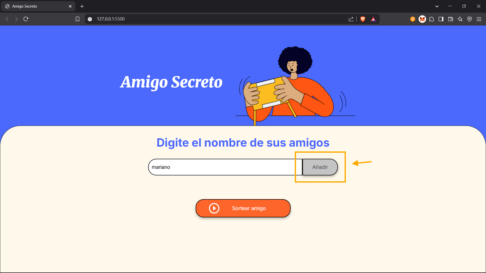

# Practicando Lógica de Programación: Challenge Amigo secreto

## Descripción

En este proyecto se presenta el desafío de hacer una aplicación con la que los usuarios puedan ingresar varios nombres en un campo de texto y apretando en el botón “Adicionar” agregarlos en una lista de amigos, la cual será visible en la página, para luego realizar un sorteo aleatorio presionando el botón “sortear amigo” y mostrar en pantalla uno de los nombres

## Objetivos

- Agregar nombres: Los usuarios escribirán el nombre de un amigo en un campo de texto y lo agregarán a una lista visible al hacer clic en "Adicionar".

- Validar entrada: Si el campo de texto está vacío, el programa mostrará una alerta pidiendo un nombre válido.

- Visualizar la lista: Los nombres ingresados aparecerán en una lista debajo del campo de entrada.

- Sorteo aleatorio: Al hacer clic en el botón "Sortear Amigo", se seleccionará aleatoriamente un nombre de la lista y se mostrará en la página.

## Funcionalidades

1. Para empezar a usar la aplicacion, lo primero es ir agrega un nombre en el campo de texto.

2. Luego de eso, presionar el boton “Añadir” para agregar el nombre a la lista de amigos.

3. seguir asi hasta tener todo los nombres anotados.

4. presionar “sortear amigo” y para mostrar el amigo que saldra sorteado.

## Desarrollador

- Marco Antonio Falcon Salvador